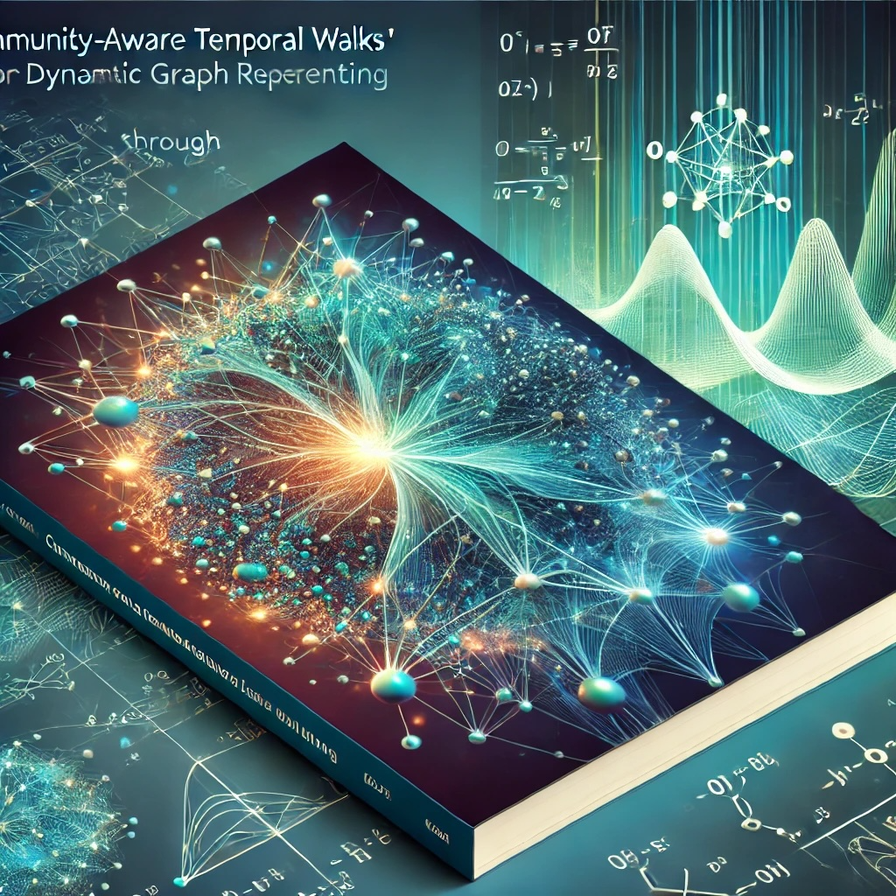

# Community-Aware Temporal Walks: Parameter-Free Representation Learning on Continuous-Time Dynamic Graphs

[](https://)
[](https://www.youtube.com/watch?v=)

## Introduction
Dynamic graph representation learning plays a crucial role in understanding evolving behaviors. However, existing methods often struggle with flexibility, adaptability, and the preservation of temporal and structural dynamics. To address these issues, we propose Community-aware Temporal Walks (CTWalks), a novel framework for representation learning on continuous-time dynamic graphs. CTWalks integrates three key components: a community-based parameter-free temporal walk sampling mechanism, an anonymization strategy enriched with community labels, and an encoding process that leverages continuous temporal dynamics modeled via ordinary differential equations (ODEs).  This design enables precise modeling of both intra- and inter-community interactions, offering a fine-grained representation of evolving temporal patterns in continuous-time dynamic graphs. CTWalks theoretically overcomes locality bias in walks and establishes its connection to matrix factorization. Experiments on benchmark datasets demonstrate that CTWalks outperforms established methods in temporal link prediction tasks, achieving higher accuracy while maintaining robustness.
<p align="center">

</p>


## Requirements
- matplotlib==3.3.4
- numba==0.54.1
- numpy==1.19.2
- pandas==1.2.2
- scikit_learn==1.1.1
- torch==1.7.1
- torchdiffeq==0.2.2
- tqdm==4.59.0

To install all dependencies:
```
pip install -r requirements.txt
```

## Dataset and Preprocessing

### Option 1. Use Our Preprocessed Datasets

- You can download the preprocessed datasets using the following links:
  1. [CollegeMsg Dataset](https://snap.stanford.edu/data/CollegeMsg.html)
  2. [MOOC Dataset](http://snap.stanford.edu/jodie/mooc.csv)
  3. [Enron Dataset](http://www.cs.cmu.edu/~enron/)
  4. [Taobao Dataset](https://tianchi.aliyun.com/dataset/dataDetail?dataId=649&userId=1)
  5. [Wikipedia Dataset](http://snap.stanford.edu/jodie/wikipedia.csv)
  
- After downloading the datasets, unzip the files.
- Place all the dataset files under the `./data` directory.

### Option 2. Preprocess Datasets Yourself

- Please refer to our paper to download the raw datasets.
- After downloading the raw datasets, place them under the `./data` directory.
- Use the provided preprocessing scripts for the raw `.csv` files. For example:
  - For the CollegeMsg dataset, run the preprocessing script directly:
    ```bash
    python UCI.py
    ```
  - For the Taobao dataset, run the preprocessing steps by executing:
    ```bash
    python taobao_preprocessing.ipynb
    ```
    Followed by:
    ```bash
    python taobao.py
    ```

## Model training

Here we provide three examples. Firstly, enter the directory with training scripts:

```cd scripts/```

To train on the UCI dastaset:
- Inductive: ```bash UCI_inductive.sh```
- Transductive: ```bash UCI_transductive.sh```


To train on the Enron dastaset:
- Inductive: ```bash enron_inductive.sh```
- Transductive: ```bash enron_transductive.sh```

To train on the Taobao dastaset:
- Inductive: ```bash taobao_inductive.sh```
- Transductive: ```bash taobao_transductive.sh```

## Detailed usage

Please refer to the function ```get_args()``` in ```util.py``` for the detailed description of each hyperparameter.

## 📝 Citation

If you find CTWalks useful for your research, please consider citing the associated [paper](https://ieeexplore.ieee.org/document/11199959):

```
@ARTICLE{11199959,
  author={Yu, He and Liu, Jing},
  journal={IEEE Transactions on Cybernetics}, 
  title={Community-Enhanced Temporal Walks: Debiasing Locality Representation Learning on Continuous-Time Dynamic Graphs}, 
  year={2025},
  volume={},
  number={},
  pages={1-14},
  keywords={Community structure;CTDG;dynamic graph;link prediction;representation learning},
  doi={10.1109/TCYB.2025.3616970}}

```


## Acknowledgement
Our implementation adapts the code of [CAWs](https://github.com/snap-stanford/CAW) as the code base and extensively adapts it to our purpose. We thank the authors for sharing their code.


